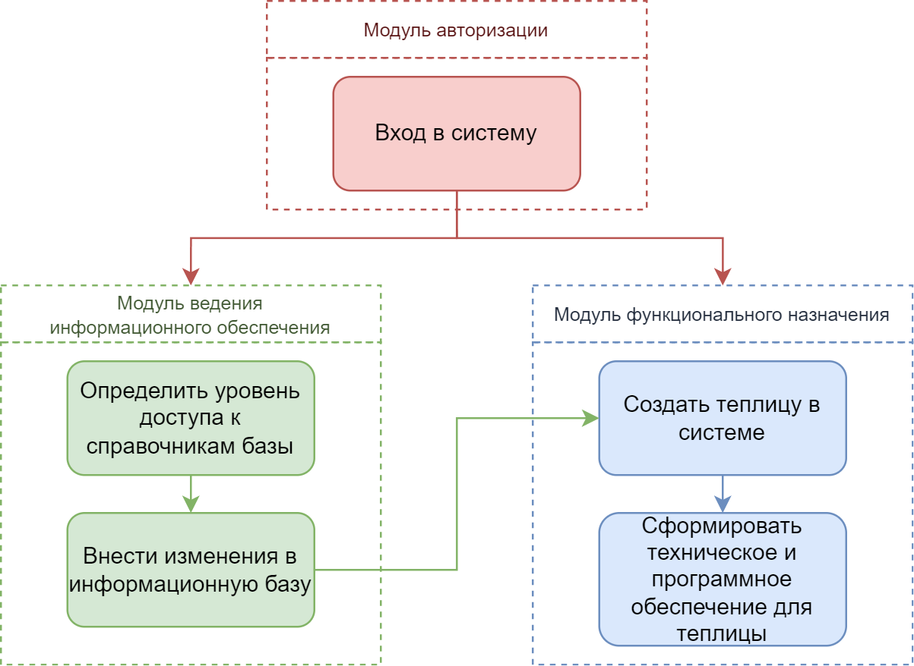
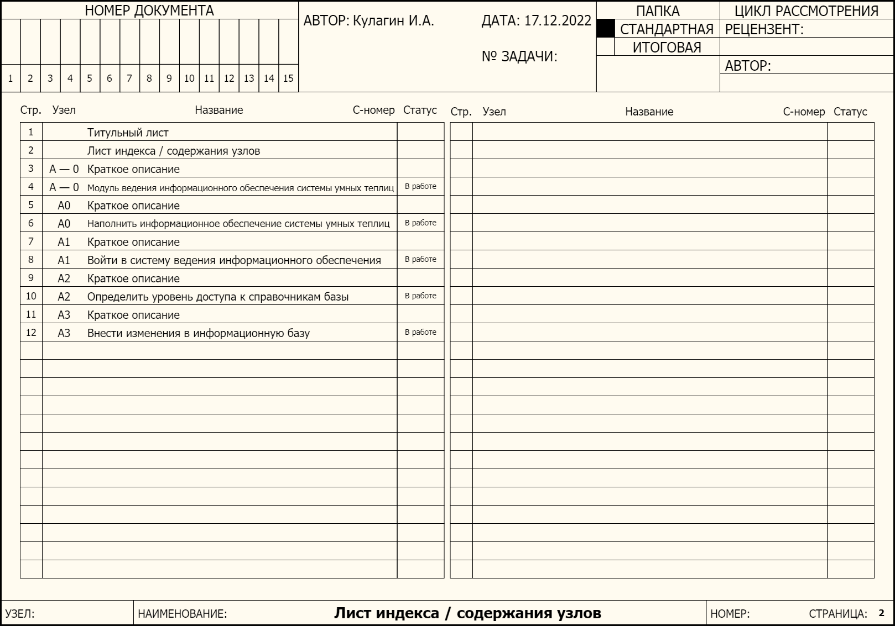
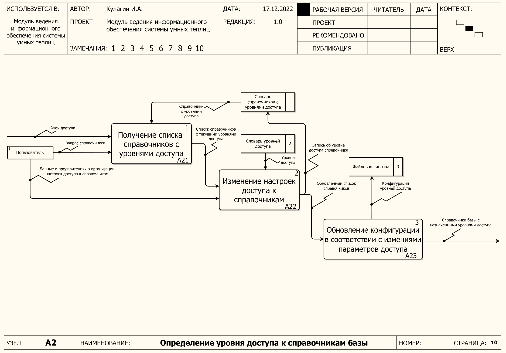

# Описание проекта архитектуры модуля ведения информационного обеспечения системы мониторинга и управления умными теплицами

# Аннотация

Описание проекта архитектуры модуля ведения информационного обеспечения системы мониторинга и управления умными теплицами».

В рамках данной работы выполнено проектирование архитектуры с обоснованием требуемой глубины проектирования, достаточной для реализации минимального жизнеспособного продукта. В результате проектирования описан контекст будущей архитектуры с указанием функционального назначения, целей разработки. Для основных функциональных модулей разрабатываемого проекта представлено высокоуровневое проектирование. Проект описания архитектуры разработан с уклоном в сторону архитектурного решения SIEMENS 6.

В тексте данной работы приведены рисунки, демонстрирующие в виде диаграмм IDEF0 – функциональное назначение системы, DFD – потоки данных в системе, диаграмму классов в нотации UML 2.5, ER-диаграмму, отражающую физическую модель данных для проектирования структуры базы данных системы мониторинга и управления умными теплицами. Описаны таблицы проектируемой базы данных. В процессе написания работы были использованы различные источники информации. В состав работы входят:

- 45 страниц
- 10 рисунков
- 16 таблиц

- 11 источников информации

- 2 приложения

# Введение

Рост численности населения, изменения климата и урбанизация приводят к большему спросу на продукты. Эффективное выращивание агрокультур требует непрерывного ухода, с целью автоматизации тепличной рутины внедряются умные теплицы.

Целью работы является проектирование архитектуры системы для упрощения подбора компонентов для создания умных теплиц и организации процессов мониторинга и управления умными теплицы, именуемой «Система мониторинга и управления умными теплицами», далее СМиУУТ, состоящей из двух модулей: «Модуль функционального назначения» и «Модуль ведения информационного обеспечения».

Для достижения цели работы решаются следующие задачи:

- Проведение анализа предметной области в области разработки модулей для ведения информационного обеспечения, систем интернета вещей;
- Обоснование требуемой глубины проектирования, достаточную для корректной реализации MVP;
- Описать контекст будущей архитектуры программы с указанием функционального назначения и целей разработки;
- Разработать верхнеуровневый дизайн (HLD) основных функциональных модулей разрабатываемого проекта;
- Разработать проект описания архитектуры программы в соответствии с ГОСТ Р 57100-2016/ISO/IEC/IEEE 42010:2011 с уклоном в сторону архитектурного решения SIEMENS.

Ожидаемым результатом работы является проект архитектуры системы мониторинга и управления умными теплицами.

# 1 Анализ предметной области

Умная теплица – это полностью автоматизированная конструкция, призванная облегчить процесс выращивания агрокультур и минимизировать использование ручного труда. Этот сельскохозяйственный объект включает в себя микроконтроллеры, датчики и приложения «интернета вещей» [1].

В основе любой умной теплицы – датчики, исполнительные механизмы, системы мониторинга и управления, которые в комплексе позволяют оптимизировать многие факторы и условия роста агрокультур.

Интернет вещей (IoT) – сеть физических объектов, использующих датчики и API-интерфейсе для связи и обмена данными в сети [2];

Датчик IoT – компонент интернета вещей, осуществляющий сбор информации о работе различных устройств и передачу этой информации на сервер обработки.

Устройство IoT – компонент интернета вещей, представляющий из себя физический объект, осуществляющий взаимодействие с реальным миром.

Контроллер IoT – компонент интернета вещей, выполняющий функции управления физическими процессами: сбор информации с датчиков, анализ информации, передача для дальнейшей обработки на сервер.

Модуль функционального назначения системы отвечает за формирование теплиц по заданным исходным параметрам (выбранное растение и контроллер), а также за мониторинг, событийное информирование и управление теплицами посредством пользовательских дэшбордов.

Модуль информационного обеспечения системы [3] отвечает за наполнение системы информацией о новых датчиках, контроллерах, устройствах, используемых протоколов для обмена данными, растениях, их требованиях к условиям ухода, типах слежения за показателями условий среды внутри теплицы.

# 2 Описание проекта архитектуры

Данный проект архитектуры изложен в соответствии с ГОСТ Р 57100-2016/ISO/IEC/IEEE 42010:2011 [4] и представляет собой последовательность описания текущей архитектуры СМиУУТ.

Для построения логики данного проекта понимается, что архитектура рассматривается с двух точек зрения: функционал и данные системы.

## 2.1 Контекст описания архитектуры

Контекст описания архитектуры строится на модели контекста, приведённого в п. 4.2.1 ГОСТ 57100 и представлен на рисунке (Рисунок 2.1 – Контекст описания архитектуры).

Рисунок 2.1 – Контекст описания архитектуры

В соответствии с представленной моделью контекста требуется конкретизировать её составляющие. Данная конкретизация представлена в таблице (Таблица 2.1 – Контекст описания архитектуры СМиУУТ).

Таблица 2.1 – Контекст описания архитектуры СМиУУТ

| № | Наименования аспекта контекста архитектуры | Конкретизация                                                                                                                                                           |
| --- | --- |-------------------------------------------------------------------------------------------------------------------------------------------------------------------------|
| **Заинтересованное лицо:** |
| 1.1 | Пользователи системы | Владельцы теплиц                                                                                                                                                        |
| 1.2 | Операторы системы | Специалист по ведению информационного обеспечения                                                                                                                       |
| 1.3 | Владельцы системы | Кулагин Иван Антонович Бартенев Борис Константинович                                                                                                                     |
| 1.4 | Разработчики системы | Кулагин Иван Антонович Бартенев Борис Константинович                                                                                                                     |
| **Цель и назначение** |
| 2.1 | Цель | Проектирование архитектуры системы мониторинга и управления умными теплицами                                                                                            |
| 2.2 | Функциональное назначение | Наполнение информационного обеспечения системы мониторинга и управления теплицами; Создание теплицы по заданным параметрами; Формирование правил для управления теплицами; |
| 2.3 | Эксплуатационное назначение | Формирование умных теплиц по заданным параметрам, мониторинг и управление созданной теплицей;                                                                           |
| **Системный интерес** |
| 3.1 | Интерес | Упрощение автоматизации теплиц                                                                                                                                          |
| **Система** |
| 4.1 | Наименование | СМиУУТ, «Система мониторинга и управления умными теплицами»                                                                                                             |
| 4.2 | Тип системы | Платформа                                                                                                                                                               |
| **Окружающая среда** |
| 5.1 | Тип окружающей среды | Аппаратное обеспечение, выраженное в виде комплекса средств вычислительной техники                                                                                      |
| **Архитектура и описание архитектуры** |
| 6.1 | Тип архитектуры | Программная                                                                                                                                                             |
| 6.2 | Способ описания архитектуры | Через архитектурное решение SIEMENS                                                                                                                                     |

## 2.2 Архитектурное решение

### 2.2.1 Точка зрения на архитектуру

Основная точка зрения данного проекта на архитектуру – разработка. Все представления, процессы, элементы архитектуры и их взаимосвязи представлены с точки зрения разработки программного обеспечения.

### 2.2.2 Структура архитектуры

За основу была взята структура архитектуры SIEMENS [5], так как лучше всего подходит для описания архитектуры с точки зрения разработки программного обеспечения и лучшим образом показывает взаимосвязи ключевых элементов архитектуры. Данный пример структуры представлен в примечании п. 4.5 ГОСТ 57100.

Базовое представление данного архитектурного решения базируется на трёх основных структурах:

- Исполнение;
- Аппаратура;
- Исходный код.

Взаимосвязь данных элементов архитектурного решения представлена на рисунке (Рисунок 2.2 – Архитектурное решение SIEMENS).

Рисунок 2.2 – Архитектурное решение SIEMENS

Данное архитектурное решение включает в основной блок архитектуры систему видов, которая включает:

- Концептуальный вид как описание архитектуры системы в понятиях, раскрывающих основные элементы автоматизированной системы (далее АС) и связи между ними;
- Модульный вид, раскрывающий функциональную декомпозицию АС и её распределение по уровням детализации;
- Вид с позиции кодов, включающих кодовые компоненты и их библиотечную организацию в среде разработки.

### 2.2.3 Проблемно-ориентированная структура архитектуры

Применительно к разрабатываемой системе и особенностей описания архитектуры в соответствии с ГОСТ 57100 представленное ранее архитектурное решение требует дополнений для лучшего понимания.

Добавленные элементы:

- Архитектурный стиль – раскрывает АС с позиций рациональной декларативно-процедурной структуризации её ПО, учитывающий специфики варианта реализации;
- Архитектурный подход/парадигма – акцент на том, что в определённом направлении является базовым или центральным в разработках и использовании архитектуры.

С учетом представленных расширений архитектурного решения оно приобретает следующий вид (Рисунок 1.3 – Структура проблемно-ориентированной структуры архитектуры).

Рисунок 2.3 – Структура проблемно-ориентированной структуры архитектуры

Дальнейшие пункты раскрывают каждый компонент как архитектуры, так и самого архитектурного решения.

### 2.2.4 Архитектурный подход

В качестве основного архитектурного подхода выбран объектно-ориентированный подход к разработке ПО, так как сущности предметной области удобнее всего представить в данном проекте в виде классов, однотипные экземпляры которых будут генерироваться и обрабатываться как на стороне приложения, так и на стороне сервера БД.

Характеристика данной парадигмы представлена в таблице (Таблица 2.2 – Характеристики объектно-ориентированного архитектурного подхода).

Таблица 2.2 – Характеристики объектно-ориентированного архитектурного подхода

| **Характеристика** | **Описание для ООП** |
| --- | --- |
| Ключевые понятия | Класс, Интерфейс, Объект, ссылка |
| Фокус | Идентификация и определение классов (объектов) и их взаимодействия |
| Ключевые особенности | Инкапсуляция операций и состояний, ссылки между объектами и методы вызова |
| Ключевые выгоды | Эффективность, Компактность, Зрелые технологии и языки |
| Ключевые аспекты | Зависимость, низкая гранулированность |

Почти все аспекты архитектуры реализуется через данный подход, а в самом коде данный подход реализуется в виде архитектурного стиля или паттерна.

#### 2.2.4.1 Архитектурный стиль

В качестве основного архитектурного стиля выбран паттерн MVC (Model-View-Controller) как самый гибкий паттерн по отношению к объектно-ориентированной парадигме разработки ПО для исключение множественных зависимостей, разделения логики проекта и разделения таких понятий как «логика» и «представление».

##### 2.2.4.1.1 Архитектурный паттерн MVC

Шаблон проектирования MVC [6] предполагает разделение данных приложения, пользовательского интерфейса и управляющей логики на три отдельных компонента: Модель, Представление и Контроллер – таким образом, что модификация каждого компонента может осуществляться независимо.

Один блок отвечает за данные приложения, другой отвечает за внешний вид, а третий контролирует работу приложения. Компоненты MVC:

Модель – этот компонент отвечает за данные, а также определяет структуру приложения. Например, если вы создаете To-Do приложение, код компонента model будет определять список задач и отдельные задачи;

Представление – этот компонент отвечает за взаимодействие с пользователем. То есть код компонента view определяет внешний вид приложения и способы его использования;

Контроллер – этот компонент отвечает за связь между model и view. Код компонента controller определяет, как сайт реагирует на действия пользователя. По сути, это мозг MVC-приложения.

Схема работы данного архитектурного паттерна представлена на рисунке (Рисунок 2.4 – Архитектурный паттерн MVC).

Рисунок 2.4 – Архитектурный паттерн MVC

##### 2.2.4.1.2 Клиент-серверный стиль 3 уровня

Данный архитектурный стиль делает упор на разъяснение аппаратной инфраструктуры будущего приложения: где будет храниться само приложение, где будут храниться его данные и где будут производиться вычисления.

Для веб-приложения, у которого будет более сотни потенциальных пользователей целесообразно разделить вычисления на три уровня:

- «минимальные» вычисления – вычисления, способные без заметного ухудшения производительности выполняться на АРМ оператора (перерасчёт графического интерфейса пользователя);
- вычисления самого приложения – вычисления, которые необходимы ядру (контроллеру) приложения в данный момент (основные алгоритмические вычисления предметной области);
- вычисления по массиву данных – подготовка данных по запросу (поиск, сортировка, базовые манипуляции).

Аппаратно распределить данные вычисления может трехзвенная архитектура или клиент-серверный стиль 3 уровня [7]. В данном приложении он будет иметь следующий вид, представленный на рисунке (Рисунок 2.5 – Проект трехзвенной архитектуры СМиУУТ).

Рисунок 2.5 – Проект трехзвенной архитектуры СМиУУТ

#### 2.2.4.2 Исполнение

В соответствии с представленными выше данными и экстраполируя их на представленный архитектурный стиль трехзвенной архитектуры, типовое исполнение СМиУУТ будет выглядеть так как представлено на рисунке (Рисунок 2.6 – Исполнение СМиУУТ).

Рисунок 2.6 – Исполнение СМиУУТ

#### 2.2.4.3 Концептуальныйвид

В соответствии с представленными выше данными и экстраполируя их на представленный архитектурный стиль «Модель-Представление-Контроллер», типовое программное исполнение СМиУУТ (концептуальный вид) будет выглядеть так как представлено на рисунке (Рисунок 2.7 – Концептуальный вид (программное исполнение) СМиУУТ).

Рисунок 2.7 демонстрирует предполагаемую файловую структуру проектируемого приложения.

Рисунок 2.7 – Концептуальный вид (программное исполнение) СМиУУТ

#### 2.2.4.4 Модульныйвид

Модульный вид как функциональное отображение (исполнение) предметной области приложения должно отображать взаимодействие функциональных блоков приложения, необходимые для достижения цели разработки.

Результатом аппроксимации данного функционала в функциональные блоки верхнего уровня является схема функциональной архитектуры системы (модульный вид), представленная на рисунке (Рисунок 2.8 – Функциональная архитектура (модульный вид) СМиУУТ).

Рисунок 2.8– Функциональная архитектура (модульный вид) СМиУУТ

#### 2.2.4.5 Кодовый вид

Базово, кодовый вид как концепция прослеживаемости исходного кода и функций системы так же отображен на рисунке (Рисунок 2.8 – Функциональная архитектура (модульный вид) СМиУУТ) и дополняется диаграммой «Сущность – связь» и диаграммой классов программы с последующим описанием предполагаемых таблиц базы данных.

##### 2.2.4.5.1 Диаграмма «Сущность – связь»

Построена ER-диаграмма [8], отражающая отношения между сущностями внутри системы, используемая для дальнейшего проектирования базы данных.

Таблицы модуля информационного обеспечения системы (Рисунок 2.9, синяя рамка):

- _Plant_ - таблица с растениями, содержит имя растения и его семантику в виде краткого описания;
- _PlantRequirement_ – таблица с требованиями к уходу за растениями, включает в себя тип требования (например, "температура") и правило, представленное в виде строкового выражения, которое определяет комфортные условия роста растения. Обеспечивает связь сущностей растения Plant и типа датчика SensorType;
- _EquipmentType_ - таблица, определяющая возможные типы датчиков и устройств, включает в себя наименование типа датчика и наименование устройства (например, Mechanical Soil, Electrochemical, Airflow, Temperature) и краткое описание принципа работы;
- _Sensor_ - таблица с датчиками системы, хранит: имя датчика, протокол для работы с датчиком и тип датчика;
- _Protocol_ - таблица с протоколами для работы с элементами системы, содержит название протокола, уровень организации (Infrastructure, Semantic, Identification), сетевой стандарт, лежащий в основе протокола;
- _Controller_ - таблица с контроллерами системы, содержит имя контроллера, совместимый протокол передачи данных, платформа (например, Arduino), потребление электроэнергии контроллером;
- _Device_ - таблица с устройствами системы, содержит имя устройства, его семантику в виде краткого описания, совместимый протокол передачи данных, потребление электроэнергии устройством;
- _DictionaryList_ - таблица, которая хранит в себе все справочники с их уровнями доступа;
- _PermissionLevel_ - таблица, хранящая в себе уровни доступа, определяющая имя уровня и непосредственно само значение уровня.

Таблицы для сущностей системы (Рисунок 2.9, зелёная рамка):

- _User_ - таблица с пользователями системы, хранит почту и пароль пользователя.
- _Greenhouse_ - таблица с управляемыми системой теплицами, хранит название и примечание, обеспечивает связь с сущностями используемого контроллера Controller и выращиваемого растения Plant.
- _GreenhouseDevice_ - таблица с умными устройствами, установленными в теплицах, обеспечивает связь между сущностями теплицы Greenhouse и устройством Device.
- _GreenhouseSensor_ - таблица с сенсорами, установленными в теплицах, обеспечивает связь между сущностями теплицы Greenhouse и сенсором Sensor.
- _Dashboard_ - таблица с дашбордами, хранит название дашборда, обеспечивает связь между сущностями пользователя User и теплицы Greenhouse.
- _DashboardProperty_ - таблица со свойствами дашборда, хранит условия для отправки уведомлений, обеспечивает связь сущности дашборда Dashboard с датчиком теплицы GreenhouseSensor или устройством теплицы GreenhouseDevice.

На рисунке 2.9 представлена ER-диаграмма проектируемой системы.

Рисунок 2.9 – ER-диаграмма системы мониторинга и управления умными теплицами

##### 2.2.4.5.2 Диаграмма классов программы

На рисунке 2.10 представлена UML-диаграмма классов [9], отражающая поля и методы классов системы, а также отношения между классами.

Рисунок 2.10 – UML-диаграмма классов программы

##### 2.2.4.5.3 Описание базы данных

В Таблице 2.3 описаны таблицы стандартной схемы public базы данных с расшифровкой именования и функционального назначения таблиц.

Таблица 2.3 — Таблицы схемы public

| № | **Наименование таблицы** | **Расшифровка** | **Функциональное назначение** |
| --- | --- | --- | --- |
| 1 | protocols | Протоколы | Словарь используемых в системе протоколов |
| 2 | equipment\_types | Типы оборудования | Словарь используемых в системе типов оборудования |
| 3 | controllers | Контроллеры | Словарь используемых в системе контроллеров |
| 4 | devices | Устройства | Словарь используемых в системе устройств |
| 5 | sensors | Сенсоры | Словарь используемых в системе сенсоров |
| 6 | plants | Растения | Словарь используемых в системе растений |
| 7 | plant\_requirements | Требования растений | Словарь требований используемых в системе растений |
| 8 | greenhouses | Теплицы | Таблица с данными созданных теплиц |
| 9 | greenhouse\_devices | Устройства теплицы | Таблица с данными устройств созданных теплиц |
| 10 | greenhouse\_sensors | Сенсоры теплицы | Таблица с данными сенсоров созданных теплиц |
| 11 | users | Пользователи | Таблица с пользователями |
| 12 | dashboards | Дашборды | Таблица с дашбордами пользователей |
| 13 | dashboard\_properties | Свойства дашбордов | Таблица с данными, представленными в дашбордах, и правилами для отправки уведомлений пользователям |

В Таблицах 2.4 – 2.16 описаны сущности и их атрибуты физической модели базы данных.

Таблица 2.4 – Таблица protocols

| **Номер** | **Название столбца** | **Тип данных** | **Описание** |
| --- | --- | --- | --- |
| 1 | id | Integer | Идентификатор |
| 2 | name | Varchar | Название протокола |
| 3 | organization\_level | Varchar | Сетевое назначение в архитектурной модели IoT |
| 4 | network\_standard | Varchar | Сетевой стандарт, поверх которого работает протокол |

Таблица 2.4 – Таблица equipment\_types

| **Номер** | **Название столбца** | **Тип данных** | **Описание** |
| --- | --- | --- | --- |
| 1 | id | Integer | Идентификатор |
| 2 | name\_sensor | Varchar | Название сенсоров этого типа |
| 3 | name\_device | Varchar | Название устройств этого типа |
| 4 | description | Varchar | Описание типа |

Таблица 2.6 – Таблица controllers

| **Номер** | **Название столбца** | **Тип данных** | **Описание** |
| --- | --- | --- | --- |
| 1 | id | Integer | Идентификатор |
| 2 | protocol\_id | Integer | Идентификатор используемого протокола |
| 3 | name | Varchar | Название контроллера |
| 4 | platform | Varchar | Платформа контроллера (например Arduino) |

Таблица 2.7 – Таблица devices

| **Номер** | **Название столбца** | **Тип данных** | **Описание** |
| --- | --- | --- | --- |
| 1 | id  | Integer | Идентификатор |
| 2 | type\_id | Integer | Идентификатор типа |
| 3 | protocol\_id | Integer | Идентификатор используемого протокола |
| 4 | name | Varchar | Название устройства |

Таблица 2.8 – Таблица sensors

| **Номер** | **Название столбца** | **Тип данных** | **Описание** |
| --- | --- | --- | --- |
| 1 | id  | Integer | Идентификатор |
| 2 | type\_id | Integer | Идентификатор типа |
| 3 | protocol\_id | Integer | Идентификатор используемого протокола |
| 4 | name | Varchar | Название сенсора |

Таблица 2.9 – Таблица plants

| **Номер** | **Название столбца** | **Тип данных** | **Описание** |
| --- | --- | --- | --- |
| 1 | id | Integer | Идентификатор |
| 2 | name | Varchar | Название растения |
| 3 | definition | Varchar | Описание растения |

Таблица 2.10 – Таблица plant_requirements

| **Номер** | **Название столбца** | **Тип данных** | **Описание** |
| --- | --- | --- | --- |
| 1 | id | Integer | Идентификатор |
| 2 | plant\_id | Integer | Идентификатор растения |
| 3 | type\_id | Integer | Идентификатор типа устройств, которые отвечают за соблюдение этого требования |
| 4 | value\_rule | Varchar | Правило для включения устройства в зависимости от значения сенсора |

Таблица 2.11 – Таблица greenhouses

| **Номер** | **Название столбца** | **Тип данных** | **Описание** |
| --- | --- | --- | --- |
| 1 | id | Integer | Идентификатор |
| 2 | controller\_id | Integer | Идентификатор используемого контроллера |
| 3 | plant\_id | Integer | Идентификатор растения теплицы |
| 4 | name | Varchar | Название теплицы |
| 5 | note | Text | Примечание к теплице |

Таблица 2.12 – Таблица greenhouse_devices

| **Номер** | **Название столбца** | **Тип данных** | **Описание** |
| --- | --- | --- | --- |
| 1 | id | Integer | Идентификатор |
| 2 | greenhouse\_id | Integer | Идентификатор теплицы |
| 3 | device\_id | Integer | Идентификатор устройства |

Таблица 2.13 – Таблица greenhouse_sensors

| **Номер** | **Название столбца** | **Тип данных** | **Описание** |
| --- | --- | --- | --- |
| 1 | id | Integer | Идентификатор |
| 2 | greenhouse\_id | Integer | Идентификатор теплицы |
| 3 | sensor\_id | Integer | Идентификатор сенсора |

Таблица 2.14 – Таблица users

| **Номер** | **Название столбца** | **Тип данных** | **Описание** |
| --- | --- | --- | --- |
| 1 | id | Integer | Идентификатор |
| 2 | email | Varchar | Почта пользователя |
| 3 | password | Varchar | Пароль пользователя |

Таблица 2.15 – Таблица dashboards

| **Номер** | **Название столбца** | **Тип данных** | **Описание** |
| --- | --- | --- | --- |
| 1 | id | Integer | Идентификатор |
| 2 | user\_id | Integer | Идентификатор владельца дашборда |
| 3 | greenhouse\_id | Integer | Идентификатор теплицы |
| 4 | name | Varchar | Название дашборда |

Таблица 2.16 – Таблица dashboard_properties

| **Номер** | **Название столбца** | **Тип данных** | **Описание** |
| --- | --- | --- | --- |
| 1 | id | Integer | Идентификатор |
| 2 | dashboard\_id | Integer | Идентификатор дашборда |
| 3 | greenhouse\_equipment\_id | Integer | Идентификатор оборудования, показания которого нужно отображать |
| 4 | greenhouse\_equipment\_type | Varchar | Вид оборудования, показания которого нужно отображать |
| 5 | notify\_rule | Varchar | Правило для отправки пользователю уведомления |

Таким образом, было составлено описание сущностей модели данных проектируемой базы данных для ER-диаграммы, отражающей предполагаемый вид физической модели базы данных (Рисунок 2.10).

# 3 Архитектура программы

## 3.1 Функциональная архитектура системы

Функциональная архитектура модуля ведения информационного обеспечения СМиУУТ представлена в виде функциональной модели, включающей в себя описание в качестве двухуровневой декомпозиции основных функциональных возможностей с использованием нотации IDEF0 [10].

Все уровни модели и краткое описание каждого из них представлены в Приложении А.

## 3.2 Потоки данных системы

Потоки данных модуля ведения информационного обеспечения СМиУУТ представлены в виде модели в нотации DFD [11].

Контекстная модель и уровни декомпозиции модели, краткое описание каждого из уровней представлены в Приложении Б.

# Заключение

В результате выполнения работы было выполнено проектирование архитектуры системы для упрощения подбора компонентов для создания умных теплиц и организации процессов мониторинга и управления умными теплицы, именуемой «Система мониторинга и управления умными теплицами», далее СМиУУТ, состоящей из двух модулей: «Модуль функционального назначения» и «Модуль ведения информационного обеспечения».

Для достижения цели были выполнены следующие задачи:

- Проведен анализ предметной области в области разработки модулей для ведения информационного обеспечения, систем интернета вещей;
- Обоснована требуемая глубина проектирования, достаточная для корректной реализации MVP;
- Описан контекст будущей архитектуры программы с указанием функционального назначения и целей разработки;
- Разработан верхнеуровневый дизайн (HLD) основных функциональных модулей разрабатываемого проекта;
- Разработан проект описания архитектуры программы в соответствии с ГОСТ Р 57100-2016/ISO/IEC/IEEE 42010:2011 с уклоном в сторону архитектурного решения SIEMENS.

# Приложение А

Рисунок A.1 – Титульный лист IDEF0

Рисунок A.2 – Страницы IDEF0

Рисунок A.3 – Описание контекстной диаграммы функциональной модели (А – 0)

Рисунок A.4 – Контекстная диаграмма функциональной модели (А – 0)

Рисунок A.5 – Описание декомпозиции контекстной диаграммы функциональной модели (А0)

Рисунок A.6 – Декомпозиция контекстной диаграммы функциональной модели (А0)

Рисунок A.7 – Описание декомпозиции блока «Войти в систему ведения информационного обеспечения» (A1)

Рисунок A.8 – Декомпозиция функционального блока «Войти в систему ведения информационного обеспечения» (A1)

Рисунок A.9 – Описание декомпозиции функционального блока «Определить уровень доступа справочникам базы» (A2)

Рисунок A.10 – Декомпозиция функционального блока «Определить уровень доступа к справочникам базы» (A2)

Рисунок A.11 – Описание декомпозиции функционального блока «Внести изменения в базу» (А3)

Рисунок A.12 – Декомпозиция функционального блока «Внести изменения в информационную базу» (А3)

# Приложение Б

Рисунок Б.1 – Титульный лист DFD

Рисунок Б.2 – Страницы DFD

Рисунок Б.3 – Описание контекстной диаграммы модели потока данных (А – 0)

Рисунок Б.4 – Контекстная диаграмма модели потока данных (А – 0)

Рисунок Б.5 – Описание декомпозиции процесса «Наполнение информационного обеспечения СМиУУТ» (А0)

Рисунок Б.6 –Декомпозиции процесса «Наполнение информационного обеспечения СМиУУТ» (А0)

Рисунок Б.7 – Описание декомпозиции процесса «Вход в систему» (А1)

Рисунок Б.8 –Декомпозиции процесса «Вход в систему» (А1)

Рисунок Б.9 –Описание декомпозиции процесса «Определение уровня доступа к справочникам базы» (А2)

Рисунок Б.10 –Декомпозиция процесса «Определение уровня доступа к справочникам базы» (А2)

Рисунок Б.11 –Описание декомпозиции процесса «Внесение изменений в информационную базу» (А3)

Рисунок Б.12 –Декомпозиция процесса «Внесение изменений в информационную базу» (А3)